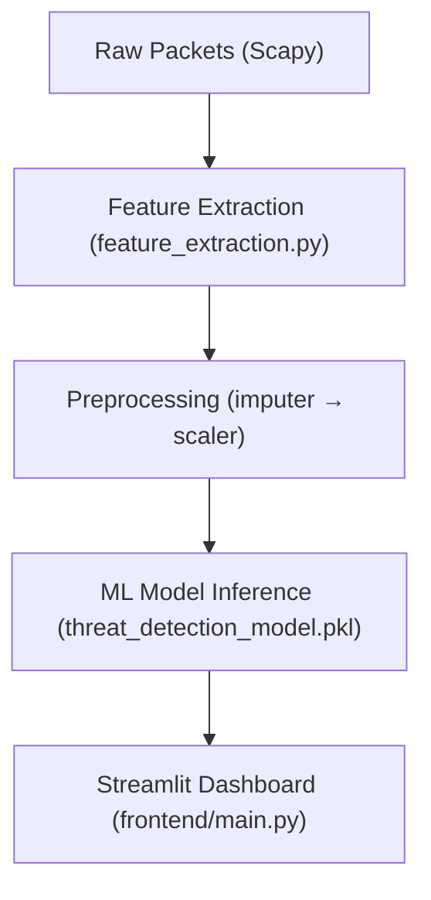
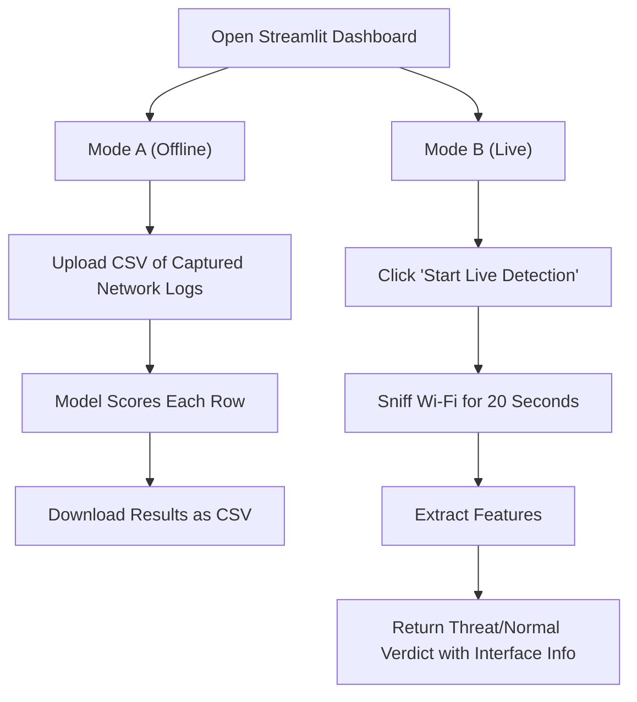

<h1 align="center">🛡️ AI-Enhanced Cybersecurity Threat Detector</h1>

<p align="center">
  
  
  
  
  
</p>

A real-time network security monitoring tool that uses machine learning to classify Wi-Fi traffic as benign or malicious. The application supports two distinct operational modes: **live packet sniffing** (capturing active Wi-Fi traffic) and **offline CSV log analysis** (evaluating historical traffic records).


---

## 📋 Project Overview
This project is a Python-based security monitoring application designed to identify network anomalies and malicious behavior on Wi-Fi networks. By leveraging **Scapy** for network packet capture/parsing and a **Random Forest Classifier** trained on network flow features, the tool analyzes packet patterns to classify traffic into two states:
- **✅ Normal Activity**: Safe, typical network behavior.
- **🚨 Threat Detected!**: Suspicious patterns matching malicious activity.

---

## 💡 Why This Project Exists
Public and home Wi-Fi networks are highly vulnerable to various cyber attacks such as Denial of Service (DoS), port scanning, and Man-in-the-Middle (MITM) exploits. Traditional firewalls and Intrusion Detection Systems (IDS) rely heavily on static, rule-based signatures. While effective against known signatures, they struggle to identify novel, zero-day attacks or subtle anomalous patterns. This tool uses machine learning to evaluate multi-dimensional flow characteristics, catching anomalous patterns that rigid rules would miss.

---

## ✨ Key Features
- 🔎 **Real-time Packet Capture**: Sniffs active Wi-Fi traffic directly from the network interface using Scapy.
- 🧠 **ML-based Traffic Classification**: Performs binary classification (Normal vs. Threat) using a trained Random Forest model.
- ⚙️ **On-the-fly Feature Extraction**: Processes raw packets into 27 statistical flow features (including flow duration, Inter-Arrival Times (IAT), packet length statistics, and destination port data).
- 📊 **Offline CSV Analysis Mode**: Upload existing CSV network logs for scoring and analysis.
- 📉 **Streamlit Dashboard**: A clean, interactive web dashboard presenting live packet details, Wi-Fi info, and detection summaries with downloadable results.
- 🎛️ **Wi-Fi Interface Auto-detection**: Automatically detects the active Wi-Fi network interface across Windows, Linux, and macOS.

---

## 🏗️ Architecture
The tool uses a three-layer pipeline:



1. **Ingestion Layer**: Captures raw packets via Scapy (live sniffing) or parses uploaded CSV files.
2. **Feature Extraction & Preprocessing**: Extracts statistical attributes (e.g., min/max/mean packet lengths, packet inter-arrival times) from the packet stream, imputes missing values using a trained imputer, and scales the inputs using a standard scaler.
3. **Inference & UI Layer**: Feeds scaled features to the Random Forest model and presents results via the Streamlit web dashboard.

---

## 🛠️ Tech Stack
| Technology | Purpose |
| :--- | :--- |
| **Python** | Core application language |
| **Scapy** | Network packet capture, sniffing, and payload parsing |
| **scikit-learn** | Machine learning preprocessing pipelines and model inference |
| **joblib** | Model and preprocessing pipeline serialization |
| **pandas** | Structured feature DataFrame manipulation |
| **Streamlit** | Interactive user interface and dashboard construction |

---

## 📐 Engineering Decisions
- **Scapy over tcpdump**: Chosen because Scapy provides a Python-native packet parsing and manipulation API, removing the need for external CLI dependencies and sub-processing for packet inspection.
- **Joblib Serialization**: Used to serialize/deserialize the Random Forest model (`threat_detection_model.pkl`), imputer (`imputer.pkl`), and scaler (`scaler.pkl`) for near-instantaneous model loading without training overhead at runtime.
- **Streamlit**: Selected for the user dashboard to allow rapid iteration without the overhead of building a dedicated frontend framework (like React or Vue) and managing API endpoints.
- **Strict Preprocessing Pipeline**: The `imputer` and `scaler` objects are saved directly during the training phase. At inference time, the application transforms raw features using these exact pre-fitted objects to prevent data leakage.

---

## 🤖 AI/ML Components
- **Model**: Random Forest Classifier (`RandomForestClassifier` with 100 estimators, trained via `models/train_model.py`).
- **Training Dataset**: Trained using `models/original_dataset.csv`, containing network flows formatted similarly to the standard CIC-IDS dataset.
- **Features**: 27 network flow features are extracted, including:
  - **Flow Duration**
  - **Packet Lengths**: Max, Min, Mean, and Standard Deviation (separated for forward, backward, and combined traffic)
  - **Inter-Arrival Times (IAT)**: Mean, Standard Deviation, Max for flow, forward, and backward streams
  - **Segment Sizes**: Average backward segment size
  - **Directional Counts**: Total forward and backward packet counts
  - **Port Info**: Destination Port
- **Preprocessing**: 
  - Mean imputation for missing/NaN values (via `SimpleImputer(strategy="mean")`).
  - Feature normalization and scaling (via `StandardScaler`).

---

## 🔄 User Flow



1. **Mode A (Offline)**: User uploads a CSV file of captured network logs (a tiny pre-packaged dataset is provided at [sample_dataset2.csv](models/sample_dataset2.csv) for immediate testing) -> The backend aligns and preprocesses features -> The model scores each record -> The user downloads the scored predictions as a CSV.
2. **Mode B (Live)**: User clicks "Start Live Detection" -> The tool sniffs Wi-Fi traffic on the auto-detected interface for 20 seconds -> Extracts flow statistics -> Returns a "Threat" or "Normal" verdict along with active network/interface information.

---

## 📁 Folder Structure
```
AI-ENHANCED-THREAT-DETECTION/
├── backend/
│   ├── feature_extraction.py   # Converts raw packets into a feature dictionary
│   ├── realtime_detector.py    # Sniffs Wi-Fi interfaces and runs ML inference
│   ├── utils.py                # CSV/DataFrame preprocessing and inference helper functions
│   ├── data_loader_1.py        # Utility to align dataset columns to model features
│   └── data_loader_2.py        # Utility to capture live packets and save as a CSV
├── frontend/
│   └── main.py                 # Streamlit-based web dashboard UI
├── models/
│   ├── threat_detection_model.pkl  # Trained Random Forest model binary
│   ├── scaler.pkl                  # Fitted StandardScaler binary
│   ├── imputer.pkl                 # Fitted SimpleImputer binary
│   ├── feature_names.pkl           # List of features used during model training
│   ├── sample_dataset2.csv         # Small sample dataset committed for quick testing
│   └── train_model.py              # Script to train the model and save preprocessing pipelines
├── requirements.txt            # Project dependencies
└── README.md                   # Project documentation
```

---

## ⚙️ Installation Guide

### 1. Install Prerequisites
You must install packet capture driver libraries depending on your Operating System:

- **Windows**: Install **[Npcap](https://npcap.com/)** (ensure you check the box to install Npcap in "WinPcap API-compatible mode" during installation).
- **Linux**: Install development headers for `libpcap`:
  ```bash
  sudo apt install libpcap-dev
  ```
- **macOS**: Install `libpcap`:
  ```bash
  brew install libpcap
  ```

### 2. Install Python Dependencies
Clone the repository and install the required libraries:
```bash
# Clone the repository
git clone https://github.com/Shafia-01/AI-ENHANCED-THREAT-DETECTION.git
cd AI-ENHANCED-THREAT-DETECTION

# Install dependencies
pip install -r requirements.txt
```

> [!IMPORTANT]
> Live packet detection requires elevated system privileges to bind to network interfaces. Run your terminal/command prompt as **Administrator** (Windows) or use `sudo` (Linux/macOS).

---

## 🚀 Running The Project

Run the Streamlit application from the project root:

```bash
# Run the Streamlit dashboard
streamlit run frontend/main.py
```

For live packet detection, ensure you launch Streamlit with administrator/root privileges:
- **Windows**: Search for "Command Prompt" or "PowerShell", right-click and choose **Run as Administrator**, then run `streamlit run frontend/main.py`.
- **Linux/macOS**: Run:
  ```bash
  sudo streamlit run frontend/main.py
  ```

---

## 📸 Screenshots Section
*Screenshots of the Streamlit dashboard in both offline analysis and live detection modes. (Add screenshots here)*

---

## ⚡ Performance Considerations
- **O(n) Feature Extraction**: Feature extraction scales linearly with the number of captured packets, keeping CPU usage minimal.
- **Latency vs. Accuracy**: A 20-second packet capture window represents an optimized trade-off between collecting sufficient flow data for prediction and keeping UI latency low.
- **Sub-Second Inference**: Model inference for a typical 100-row CSV completes in less than 1 second.

---

## 🔒 Security Considerations
- **Privileged Access**: The tool requires root or administrator privileges for live captures. Only execute this script on networks you own or have explicit authorization to monitor.
- **Data Privacy**: Uploaded CSV files are processed completely in memory and are not saved, cached, or persisted on any server.
- **Local Enforcement**: All model files are executed locally; no network traffic or data is sent to external APIs or third-party cloud services.

---

## 🧩 Challenges Solved
- **Feature Alignment**: Successfully mapped raw Scapy packet attributes (which are individual frame-level representations) to the flow-level statistical features (e.g., standard deviation, means, segment counts) expected by the ML model.
- **Sparse Data Handling**: Computed valid statistics (such as standard deviation and variance) on variable-length captures, gracefully handling cases with very low packet counts without triggering division-by-zero or empty sequence errors.

---

## 📄 License
This project is licensed under the MIT License.
